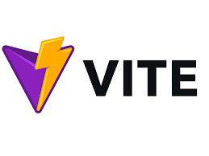
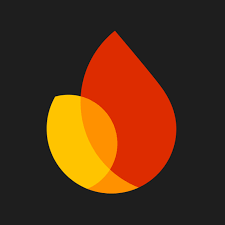

# June-Code-Jam
## Name of Website: [GreenFindr](https://www.greenfindr.us/)

This website was created by team 4 for TripleTen's June-Code-Jam.

This website was created to assist its users to find parks and recreational places during any vacation that they are on, or are planning to take. By searching any location or address in the search bar, Green Findr will locate the closest park for your enjoyment, and have the capability of saving your favorite parks!

### Technologies Used

* HTML
* CSS
* JavaScript
* React
* Vite  
* Vercel
* Firebase
* Figma
* Responsive Design

---

 **HTML, CSS**
  
This project was made utilizing a combination of coding with HTML and styling with CSS.

 **JavaScript**

This project was made utilizing JavaScript. Several functions and variables were used to assist React in this project.

 **React**

This project was made utilizing React. Several functions and variables were used to execute actionable features. React was used to tap into APIs to collect data, and use it make this website functional and adaptable in multiple locations.

 **Vite**

Vite was utilized to assist React and many of it's configurations.

 **Vercel**

Vercel was used to help build and deploy this website.

 **Firebase**

Firebase was used in the assistance of the Backend. The ability to utilize databases was instrumental here as well.
  
 **Figma**

Figma is a web based program that allows coders and designers to interact with each other for the purposes of collaborating on a project together. The purpose of the figma in this project was to give a general outline of the build

* [Link to the project on Figma](https://www.figma.com/design/orhfXe81OPKUIftkmBK7dj/GREEN-FINDR?node-id=0-1&p=f&t=FkXEiHWRwasrh6Go-0)

**Responsive Design**

This project contains an optional functionality of the website at multiple resolutions.

---
To access the site, please visit [GreenFindr.us](https://www.greenfindr.us/).

### Contributors:

- [@Buffalo-Crow](https://github.com/Buffalo-Crow)
- [@TonyRiches17](https://github.com/TonyRiches17)
- [@Majestyk1](https://github.com/Majestyk1)
- [@ThePaladin000](https://github.com/ThePaladin000)
